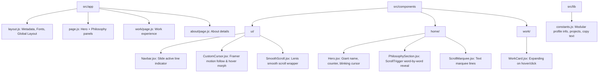

# Implementation Plan — Portfolio Clone (rishabh-upadhyay.com)

This plan outlines the architecture, layout, design tokens, and step-by-step process for building a premium, high-impact personal portfolio website modeled after [rishabh-upadhyay.com](https://www.rishabh-upadhyay.com/).

The design features a dark mode, high-contrast minimalist interface, sleek custom cursor, smooth scrolling, and stunning scroll-triggered typography reveals.

---

## User Review Required

> [!IMPORTANT]
> **Tailwind v4 Configuration**: Your codebase is initialized with Tailwind CSS v4. In Tailwind v4, configuration is defined directly inside `src/app/globals.css` using the `@theme` directive, rather than a separate `tailwind.config.js` file. We have designed our styling system around this modern approach.
>
> **Premium Typography (PP Editorial New Equivalent)**: Since `PP Editorial New` is a premium, paid font, we will integrate **Instrument Serif** and **Playfair Display** (via standard Google Fonts integration in Next.js `next/font/google`) as our high-contrast serif italic fonts. They look incredibly elegant and capture the same editorial aesthetics.
>
> **Content Customizability**: To make the portfolio versatile, all personal information (such as your name, role, projects, work history, philosophy sections, and social links) will be consolidated inside a central `src/lib/constants.js` file. This lets you toggle between "RISHABH UPADHYAY", "MUHAMMED ASHIQUE", or any other identity seamlessly.

---

## Open Questions

> [!NOTE]
> 1. **Content Adaptation**: Would you like the portfolio initialized with **Rishabh Upadhyay**'s branding details, or should we pre-populate it with **Muhammed Ashique** (which corresponds to your workspace directory)? (We recommend initializing with clean variables in `constants.js` so either can be selected via a simple configuration toggle).
> 2. **Lenis Smooth Scroll on Mobile**: Smooth scrolling (Lenis) works beautifully on desktop, but sometimes users prefer standard momentum scrolling on touch devices. We will configure Lenis to enable smooth scroll on desktop while maintaining native touch behavior on mobile for optimal performance.

---

## Proposed Changes

We will build the portfolio inside the `/frontend` directory in your active workspace using a structured component layout.



### 1. Style & Foundations

#### [MODIFY] [globals.css](file:///c:/Users/hp/Desktop/Projects/Muhammed-Ashique/frontend/src/app/globals.css)
* Configure Tailwind CSS v4 variables inside the `@theme` directive:
  * `--color-bg`: `#0a0a0a` (Near black background)
  * `--color-surface`: `#111111` (Elevated cards/sections)
  * `--color-accent`: `#e8e8e8` (Cream/off-white text)
  * `--color-muted`: `#777777` (Muted description text)
  * `--color-highlight`: `#ffffff` (Pure white accent)
  * Define custom typography families: `--font-display` (Instrument Serif), `--font-mono` (Geist Mono or JetBrains Mono), `--font-body` (Geist Sans).
* Add a global background noise overlay effect via a body `::before` pseudo-element:
  ```css
  body::before {
    content: "";
    position: fixed;
    top: 0; left: 0; width: 100vw; height: 100vh;
    content: "";
    opacity: 0.025;
    pointer-events: none;
    z-index: 9999;
    background-image: url("data:image/svg+xml,%3Csvg viewBox='0%200%20200%20200'%20xmlns='http://www.w3.org/2000/svg'%3E%3Cfilter%20id='noiseFilter'%3E%3CfeTurbulence%20type='fractalNoise'%20baseFrequency='0.65'%20numOctaves='3'%20stitchTiles='stitch'/%3E%3C/filter%3E%3Crect%20width='100%25'%20height='100%25'%20filter='url(%23noiseFilter)'/%3E%3C/svg%3E");
  }
  ```

#### [MODIFY] [layout.js](file:///c:/Users/hp/Desktop/Projects/Muhammed-Ashique/frontend/src/app/layout.js)
* Import the Google Fonts `Instrument_Serif` (italic serif) and `Geist` + `Geist_Mono`.
* Inject the custom fonts as variables: `--font-display`, `--font-mono`, and `--font-body` into the HTML class list.
* Wrap the layout with our `<SmoothScroll>` wrapper and insert the `<CustomCursor />` and `<Navbar />` components globally.

---

### 2. Core UI Components

#### [NEW] [Navbar.jsx](file:///c:/Users/hp/Desktop/Projects/Muhammed-Ashique/frontend/src/components/ui/Navbar.jsx)
* A fixed, high-z-index top bar with minimal styling.
* Links on the right: `[Home]`, `[Work]`, `[About]`.
* Animated underline indicator showing the active route using Framer Motion's `layoutId="underline"`.
* Fades in beautifully on initial mount.

#### [NEW] [CustomCursor.jsx](file:///c:/Users/hp/Desktop/Projects/Muhammed-Ashique/frontend/src/components/ui/CustomCursor.jsx)
* Uses mouse coordinates with spring animations (`framer-motion`'s `useMotionValue` + `useSpring`) to follow the mouse dynamically with inertia.
* Detects hover events on clickable items (`a`, `button`, `[data-hover]`) to morph shape, expand, or add custom visual feedback (e.g. glass ring, text inside cursor).

#### [NEW] [SmoothScroll.jsx](file:///c:/Users/hp/Desktop/Projects/Muhammed-Ashique/frontend/src/components/ui/SmoothScroll.jsx)
* A React wrapper that instantiates Lenis (`@studio-freight/lenis` or `lenis`) smooth scrolling.
* Integrates seamlessly with GSAP's ScrollTrigger by hooking into the ScrollTrigger tick system to recalculate scroll positions on scroll updates.

---

### 3. Lib & Content Config

#### [NEW] [constants.js](file:///c:/Users/hp/Desktop/Projects/Muhammed-Ashique/frontend/src/lib/constants.js)
* Store all layout variables:
  * **Profile**: Name ("RISHABH UPADHYAY" / "MUHAMMED ASHIQUE"), Subtitle ("AI | Blockchain | Web Engineer"), Speed counter configuration.
  * **Philosophy Panels**: The array of text lines, highlight words, and short descriptions for each section.
  * **Work Experience**: Structured history including company, role badge, timeline, bullet achievements, and skill tag strings.
  * **About Biography**: Extended copy, links to socials (GitHub, LinkedIn, Email, X).

---

### 4. Page Components (Home, Work, About)

#### [NEW] [Hero.jsx](file:///c:/Users/hp/Desktop/Projects/Muhammed-Ashique/frontend/src/components/home/Hero.jsx)
* Displays the giant displays for the name.
* Animated Speed Counter: Uses a Framer Motion ticker (or GSAP timer) animating up to `11.0` (with a subtitle like `Faster` or `11.0x Optimization`).
* Blinking terminal-style cursor `.?.:` on the right side.
* Custom responsive styles matching the editorial aesthetic.

#### [NEW] [PhilosophySection.jsx](file:///c:/Users/hp/Desktop/Projects/Muhammed-Ashique/frontend/src/components/home/PhilosophySection.jsx)
* Full viewport (100vh) stacked sections that reveal bold text on scroll.
* Manual character/word splitting: we will split strings into structured arrays of words.
* GSAP ScrollTrigger word-by-word stagger reveals:
  ```javascript
  gsap.from(words, {
    scrollTrigger: {
      trigger: container,
      start: "top 80%",
      end: "bottom 20%",
      toggleActions: "play none none reverse",
    },
    y: 40,
    opacity: 0,
    stagger: 0.05,
    duration: 0.8,
    ease: "power3.out"
  });
  ```

#### [NEW] [ScrollMarquee.jsx](file:///c:/Users/hp/Desktop/Projects/Muhammed-Ashique/frontend/src/components/home/ScrollMarquee.jsx)
* Infinite running text track at key sections for visual breathing space, styled with a high-contrast serif italic font.

#### [MODIFY] [page.js](file:///c:/Users/hp/Desktop/Projects/Muhammed-Ashique/frontend/src/app/page.js)
* Integrate `Hero`, `ScrollMarquee`, and a sequence of `PhilosophySection` elements mapped directly from our `constants.js`.

#### [NEW] [work/page.js](file:///c:/Users/hp/Desktop/Projects/Muhammed-Ashique/frontend/src/app/work/page.js) and [WorkCard.jsx](file:///c:/Users/hp/Desktop/Projects/Muhammed-Ashique/frontend/src/components/work/WorkCard.jsx)
* Renders the work index header ("Work Experience & Projects") using large serif italic styling.
* Displays a stack of `WorkCard` components.
* Hover animations: Card expands or gains borders, tags light up, with Framer Motion entry animations.

#### [NEW] [about/page.js](file:///c:/Users/hp/Desktop/Projects/Muhammed-Ashique/frontend/src/app/about/page.js)
* 2-column layout: Visual element/photo skeleton on the left, beautifully formatted bio on the right.
* A "Let's Connect" footer section displaying active social links and email hooks.

---

## Verification Plan

### Automated Build Verification
1. Run local dependencies installation: `npm install gsap lenis framer-motion lucide-react`
2. Validate compiler status: `npm run build` to confirm there are no SSR hydration or styling errors.

### Manual Visual Verification
1. Run the local dev server: `npm run dev`
2. Test the Custom Cursor follow speed and hover-morphing state on links.
3. Verify Lenis smooth scroll inertia across all routes.
4. Verify word-by-word scroll reveals in the philosophy sections on home.
